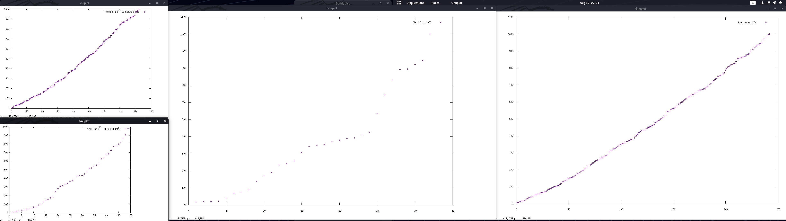

# Nos Santos Field


The image is the expansion of sum of factors in semiprimes.

# PRIME PERIOD GRIMOIRE VOL. 2

This explain how the nos santos fields works, with focus in compare RSA problem with factorization and calculate decimal expansion. All related 

Uses as a base RSA algorithm to check divisors of period in decimal expansion.

The NSF method is a efficient way to calculate the N decimal expansion, for semiprimes .

The NSF method allow you to calculate the sum of factors in a efficient way, without knowing the prime factors, when de product of primes are in the field.

The NSF method improves factorization methods for the most of small numbers and a big percentage of big numbers.

The code of NOS-SANTOS-FIELD has been writed in haskell language.

## Grimoire basis spells

This spells are from famouths maths geeks, like fermat and others

- Rsa problem 

  - Encrypt
  
    m = powMod m e n = mc

  - Descrypt

    mc = powMod
  
- Some known things

  p^2 mod 6 = 1

  N^2 = x6+1 * y6+1

  Totient = N - (sum factors) - 1

  totient mod carmichael = 0

  period T = powMod 10 T N = 1

  carmichael(n) mod T(n) = 0
  
  totient(n) mod T(n) = 0
  
  x^2-y^2 mod N = 0


# Spells logics

Any number can be represented by 

N = time * period + (sum factors N) - 1

Nos semiprimes are de product of primes who 

Deduction of a perfect prime square

p^2 * p^2 = n^2

Deduction for diferent factors

p^2 * q^2 = n^2

Then 

TODO

Then 

t = times of decimal expansion length

( (sqrt x6+1)* (sqrt y6+1) ) - ((sqrt 6x+1) + (sqrt y6+1)) +1 = t * T -> Solution rsa

p^2 - p mod T = 0

Then in squares or numbers with square proportion

N^2+N^2 - N^2  mod T = 0

or 

n^2 - x mod T = 0 

Sum Factors q p = (mod N T) * t + 1

# Conjure spells

All spells of this grimoire are in nsf.hs the source code. 

Binaries - TODO


# Casting spells

```
-- We search for NSS numbers among 512 bits and 512 bit + 1000

*Ncs> nss_map_nsq 512 1000

[13407807929942597099574024998205846127479365820592393377723561443721764030073546976801874298166903427690031858186486050853753882811946569946433649006084097,13407807929942597099574024998205846127479365820592393377723561443721764030073546976801874298166903427690031858186486050853753882811946569946433649006084171,13407807929942597099574024998205846127479365820592393377723561443721764030073546976801874298166903427690031858186486050853753882811946569946433649006084241,13407807929942597099574024998205846127479365820592393377723561443721764030073546976801874298166903427690031858186486050853753882811946569946433649006084381,13407807929942597099574024998205846127479365820592393377723561443721764030073546976801874298166903427690031858186486050853753882811946569946433649006084823]

(2.10 secs, 2,209,602,200 bytes)

-- We search for NSS numbers among 2048 bits and 2048 bit + 1000

*Ncs> nss_map_nsq 2048 1000

[32317006071311007300714876688669951960444102669715484032130345427524655138867890893197201411522913463688717960921898019494119559150490921095088152386448283120630877367300996091750197750389652106796057638384067568276792218642619756161838094338476170470581645852036305042887575891541065808607552399123930385521914333389668342420684974786564569494856176035326322058077805659331026192708460314150258592864177116725943603718461857357598351152301645904403697613233287231227125684710820209725157101726931323469678542580656697935045997268352998638215525166389437335543602135433229604645318478604952148193555853611059596230657,32317006071311007300714876688669951960444102669715484032130345427524655138867890893197201411522913463688717960921898019494119559150490921095088152386448283120630877367300996091750197750389652106796057638384067568276792218642619756161838094338476170470581645852036305042887575891541065808607552399123930385521914333389668342420684974786564569494856176035326322058077805659331026192708460314150258592864177116725943603718461857357598351152301645904403697613233287231227125684710820209725157101726931323469678542580656697935045997268352998638215525166389437335543602135433229604645318478604952148193555853611059596231637]

(33.48 secs, 19,103,871,216 bytes)

-- We search for NSS numbers among 4096 bits and 4096 bits + 1000

*Ncs> nss_map_nsq 4096 1000

[1044388881413152506691752710716624382579964249047383780384233483283953907971557456848826811934997558340890106714439262837987573438185793607263236087851365277945956976543709998340361590134383718314428070011855946226376318839397712745672334684344586617496807908705803704071284048740118609114467977783598029006686938976881787785946905630190260940599579453432823469303026696443059025015972399867714215541693835559885291486318237914434496734087811872639496475100189041349008417061675093668333850551032972088269550769983616369411933015213796825837188091833656751221318492846368125550225998300412344784862595674492194617023806505913245610825731835380087608622102834270197698202313169017678006675195485079921636419370285375124784014907159135459982790513399611551794271106831134090584272884279791554849782954323534517065223269061394905987693002122963395687782878948440616007412945674919823050571642377154816321380631045902916136926708342856440730447899971901781465763473223850267253059899795996090799469201774624817718449867455659250178329070473119433165550807568221846571746373296884912819520317457002440926616910874148385078411929804522981857338977648103126085903001302413467189726673216491511131602920781738033436090243804708340403154190337]

(195.22 secs, 65,412,011,680 bytes)

*Ncs> P.factorise 
32317006071311007300714876688669951960444102669715484032130345427524655138867890893197201411522913463688717960921898019494119559150490921095088152386448283120630877367300996091750197750389652106796057638384067568276792218642619756161838094338476170470581645852036305042887575891541065808607552399123930385521914333389668342420684974786564569494856176035326322058077805659331026192708460314150258592864177116725943603718461857357598351152301645904403697613233287231227125684710820209725157101726931323469678542580656697935045997268352998638215525166389437335543602135433229604645318478604952148193555853611059596230657

[(Prime 974849,1),(Prime 319489,1),(Prime 3560841906445833920513,1),(Prime 167988556341760475137,1),(Prime 173462447179147555430258970864309778377421844723664084649347019061363579192879108857591038330408837177983810868451546421940712978306134189864280826014542758708589243873685563973118948869399158545506611147420216132557017260564139394366945793220968665108959685482705388072645828554151936401912464931182546092879815733057795573358504982279280090942872567591518912118622751714319229788100979251036035496917279912663527358783236647193154777091427745377038294584918917590325110939381322486044298573971650711059244462177542540706913047034664643603491382441723306598834177,1)]

(255.44 secs, 139,784,410,360 bytes)

-- The same number with nos carmichael spell, th result can be used just to decrypt messages

*Ncs> nss_derivate 
32317006071311007300714876688669951960444102669715484032130345427524655138867890893197201411522913463688717960921898019494119559150490921095088152386448283120630877367300996091750197750389652106796057638384067568276792218642619756161838094338476170470581645852036305042887575891541065808607552399123930385521914333389668342420684974786564569494856176035326322058077805659331026192708460314150258592864177116725943603718461857357598351152301645904403697613233287231227125684710820209725157101726931323469678542580656697935045997268352998638215525166389437335543602135433229604645318478604952148193555853611059596230657 0

1090748135619415929462984244733782862448264161996232692431832786189721331849119295216264234525201987223957291796157025273109870820177184063610979765077554799078906298842192989538609825228048205159696851613591638196771886542609324560121290553901886301017900252535799917200010079600026535836800905297805880952350501630195475653911005312364560014847426035293551245843928918752768696279344088055617515694349945406677825140814900616105920256438504578013326493565836047242407382442812245131517757519164899226365743722432277368075027627883045206501792761700945699168497257879683851737049996900961120515655050115561271491492650348193034720874286677484276236292738360032427424499556087095685492411030037658394224675291348582549900366367751803851134229176222246053732573886716540132974692707656504829835895230804700756996390295202861628346718823341756870822754141487307239815742670278665202751081355616304460399061822178598405881592730671888574460873116555274647938675160051135013661897264411327302320062816660145275652046102386986045231714289442087627263156698025113552165137851053002154671504474163410014316150213265210996604053694215054918380243978889072417106810007251322768037625419046711242041688551816912017849643882145624091467997755147091355675734185974160209629676817478569439949760061986659873247483860151384711838819847971879800570513833402333507393938226111603954541625197001966192109968104317511803763550038288766118922098516653774476136581381014390304112974960063451749349604883803323902228760921708334299259268125946091730955314683277490942533548746506202127475807471500401460617142836800292103577992430755160251238602323394213583632656965253149096861749380516378003216408209038683421011871494287569465422531530642205205073129569493427227739546147105079664787449171649128052801709255949486484379077059258349162391480798326864932932834842515542279589315516655148314298719294501729506842778593480562532831990993194375685370360061430941009295478030667258081258763591442456839836973894497305667881102724598263788364827567908333606246994412638375833514165086405343617672500646480029965500025850930928771266185847367242628983352946677572047221550254440121493035836929609070120160792344392937267112595565218747798821770998461176733098871949180646683406498949765129952093369223845696772038548581120928627968028353467380514509562595576815401056920410765506175547033857152659648078156542286195102879131303719245035363293091973519004299352296982764041402732402399407767552

(0.01 secs, 1,948,808 bytes)


```

The spell show how easy is solve more fast many numbers than factorization for decrypt messages.

# Conclusion

All product of primes who have the same proportion n - sum factors in n^2 are really more easy to calculate a private key to decrypt a message.

The spells proves what find and decrypt with a public key and nos carmichael spell is more fast than factorize just 1 of the numerbers, if you just want to decrypt a message you can use the nos carmichael spell if the number is "vulnerable", just in 0.01 second vs 255 seconds to factorize the number with ECM parallel method.

Clearly in trillions of cases you can decrypt or solve rsa really more fast than factorization fastest methods GNFS or ECM when (p * q) are

## n^2 - NSF(e,x) mod T = 0

Many keys are vulnerable with just one operation to solve the cypher message, and some operations more to factorize the number if you can factorize NSS derivation . 

Just some seconds to get keys of 512, 1024, 2048, 4096 bits vulnerables to NOS SANTOS FIELD

If some method will exist to calculate that for all numbers directly grouped by this kind of field. Yo need to factorize after know the field and the result of the comuptation of nss . This means factorisation process is a bit expensive than decryption process.

Small number than carmichael to decrypt can be calculated , maybe in some cases is better fos computation because  the number is small than carmichael, and when the period is small than carmichael the modular inverse of exponent and carmichael can be smaller. This means in some cases can decrypt faster . 

## T(n) = lcm T1 T2

RSA algorithm allow us to check divisors of the Period. We can know if somethind is divisors of period , carmichael or euler totient. In rsa is used to decrypt messages.

````

tryperiod n period = (powMod (powMod (2) 1826379812379156297616109238798712634987623891298419 n) (modular_inverse 1826379812379156297616109238798712634987623891298419 period) n) - (2) 


````
tryperiod computes RSA algorithm to encrypt and decrypt a test number.

the maps of the demostration have a result the numbers who have the same period n^2 - NSF(e,x), who decrypts the message "2". 

This means the same funcion with the same parameters can decrypt infinite different public keys group

## PrivateKey = PublicKeyN^2 - NSF(PublicKeyE, x)

The exponenent changes the field but always contain totient , carmichael and period numbers and derivations of them.

This seams obvious , but is awesome how the decimal expansion of a number is really near of the square, allowing us to group the numbers by fields. Of course you can find new fields each time you increase the numbers, just few fields for small numbers, more fields for define big numbers. But the same field who works in small numbers works in 256, 512 , 1024, 2048. 

The numbers can stay in diferent Period Fields at the same time. Because different numbers have the same decimal expansion and they cross with others in his expansion.


# General Decimal Expansion Longitude Field Conjeture 




All numbers in a nos santos field can be factorized just by one operation. Each image represents  the numbers who can by decripted in each field, with the same field you can decrypt all different numbers, the image is in a small scale to understad how it works.

All numbers can be explained as :

## N = t * T + (SUM FACTORS) - 1

Decimal Expansion Longitude = (T) or Period

All numbers can be grouped by his period (T) field . The distance among n^2 and T multiple in any number

## nsf e x = (powMod (powMod (2) e n) (modular_inverse e n^2-x) n) - (2) == 0

## nsZ = n^2 - NSF(e,x)

To calculate decimal expansion distances of squares. The nos santos field. 

*e allways a coprime of period , totient or carmichael. using a big prime number is enougth.


## T(n^2) = lcm T(n) n

The number of groups who defines de first 1000 numbers is X TODO 

- n^2 -1

- n^2 -3

- n^2 -5

...

## Example and proof of a field englobes a group of period , carmichaels or totient,

Just one operation to decrypt messages, one quadratic more to factorize, one more to calculate the decimal expansion of N, with the same "KEY" for all group.

TODO - HERE EACH FUNCTIONS


````

*Nss> e=nss_map_nsq 2 1000 (5)

(0.01 secs, 0 bytes)

*Nss> e

[6,10,11,18,21,31,35,42,45,54,66,69,90,101,126,150,154,174,186,246,281,306,315,331,341,366,378,406,430,431,434,451,474,518,522,546,553,570,630,639,682,685,723,770,774,798,819,870,906,978,981]

(0.09 secs, 89,292,144 bytes)

*Nss> map period it

[7,11,2,19,6,15,36,43,46,55,67,22,91,4,127,151,155,175,187,247,28,307,316,110,30,367,379,407,431,215,435,10,475,519,523,547,78,571,631,35,683,686,30,771,775,799,6,871,907,979,108]

(0.07 secs, 51,419,840 bytes)

*Nss> map carmichael e

[2,4,10,6,6,30,12,6,12,18,10,22,12,100,6,20,30,28,30,40,280,48,12,330,30,60,18,84,84,430,30,40,78,36,84,12,78,36,12,210,30,136,240,60,42,18,12,28,150,162,108]
(0.01 secs, 328,512 bytes)

*Nss> map totient e

[2,4,10,6,12,30,24,12,24,18,20,44,24,100,36,40,60,56,60,80,280,96,144,330,300,120,108,168,168,430,180,400,156,216,168,144,468,144,144,420,300,544,480,240,252,216,432,224,300,324,648]


````

In the nss.hs you can review and test with the library.

# License

Free usage on Apache License 2.0 for non for commercial uses, you can't win money with this paper or derivates. Just redistribute derivates for free.

If some formula dosen't exists  you need to use a mention of the authors
To discuss with the team for commercial porpouses, you can send email to pedro@blackhole.consulting . 

More information about our services in https://blackhole.consulting

# Contributions and collaborations

All contributions are welcome and collaborations are welcome. 

If you want to collaborate as a coder in the project to develop libraies and research experiments you are invited. please contact in pedro@blackhole.consulting

Donations of hardware to build a super computer are welcome, we need graphic cards, micro processors , ram and all kind of computer components to build a cluster for make more fast the investigation. Old gpu rig miners are welcome.

If you have a place with some KW of energy we are glad to build the computer in your place.

If you have a super computer we are glad to do experiemnts toguether.

We are a small group of geeks without resources, if you want to collaborate in economical aspects for the investigation you can make a donation here .


# Authors

Main idea and investigation and dirty haskell functions.

Author - Vicent Nos Ripolles, Consultant, Dev, Cybersecurity Auditor, Bussinesman, Hacker

Functions and Performance Haskell and Maths

Author - Enrique S. , Physhicist, Maths, Computer Science

TODO - Revisado y corregido por Francisco Blas Izquierdo, Hacker, Investigator Sweeden

TODO - Revision Manuel Mollar - Retired , University Dr.


