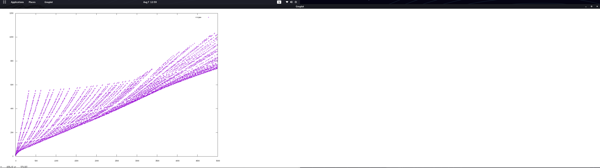

# rsa vs factorization



# PRIME PERIOD GRIMOIRE VOL. 2

The present document try to probe how rsa is more easy to solve than factorizacion of semiprimes, the important part of the public key. with the NCS method (nos-carmichael spell)

The NCS method is a efficient way to calculate the N decimal expansion.

The NCS method allow you to calculate the sum of factors in a efficient way, without knowing the prime factors, when de semi primes are NOS semiprimes.

The NCS method improves factorization methods for the most of small numbers and a big percentage of big numbers.

The code of NOS-CARMICHAEL SPELL has been writed in haskell language.

## Grimoire basis spells

- Rsa problem 

  - Encrypt
  
    m = powMod m e n = mc

  - Descrypt

    mc = powMod
  
- Some known things

  p^2 mod 6 = 1

  N^2 = x6+1 * y6+1

  Totient = N - (sum factors) - 1

  totient mod carmichael = 0

  period T = powMod 10 T N = 1

  carmichael(n) mod T(n) = 0
  
  totient(n) mod T(n) = 0
  
  x^2-y^2 mod N = 0


# Spells logics

Any number can be represented by 

N = time * period + (sum factors N) - 1

Nos semiprimes are de product of primes who 

Deduction of a perfect prime square

p^2 * p^2 = n^2

Deduction for diferent factors

p^2 * q^2 = n^2

Then 

n^2 - p^2+1 = totient ^ 2 for squares

n^2 - (p^2 + q^2) + 1 = totient ^ 2 

Then 

t = times of decimal expansion length

( (sqrt x6+1)* (sqrt y6+1) ) - ((sqrt 6x+1) + (sqrt y6+1)) +1 = t * T -> Solution rsa

p^2 - p mod T = 0


# Conjure spells


````

-- COMPUTE CARMICHAEL DERIVATION

ncs_derivate n s = n^2*n^2 - n^2 + s

-- EXTRACT PRIVATE KEY WITH EXPONEN ANT N IN NCS NUMBERS 

ncs_privatekey e n s= modular_inverse e (ncs_derivate n s)

-- CRACK LOOP WITH NCS

ncs_crack n s l
        | ch == 0 = sq
        | l ==s = 0
        | otherwise = ncs_crack n (s+1) l
        where
                sq = ncs_derivate n (s+1)
                ch = tryperiod n sq


-- MAP NCS PRODUCT OF PRIMES
ncs_map s x r= map fst (filter (\(x,c)-> c==0) $ map (\x-> (x,tryperiod x (ncs_derivate x r))) ([2^s..2^s+x]))

ncs_find nbits range = take 1 $ filter (\(v,x)-> length x==2) (map (\x-> (x,P.factorise x)) (ncs_map (nbits) range 0))


-- FACTORIZE WITH N AND (TOTIENT OR CARMICHAEL OR PERIOD)

ncs_factors n t = (head (take 1 $ filter (\x->  gcd n (x+1)/=1 ) (tail (reverse (divs t))))+1)

ncs_fac n t = (ncs_factors n t, div n (ncs_factors n t) )


-- CHECK PERIOD LENGTH FOR N
tryperiod n period = (powMod (powMod (2) 65537 n) (modular_inverse 65537 period) n) - (2) 

-- GET DIVISORS WITH ECM METHOD
divs n = read $ concat (tail (splitOn " " (show (divisors n))))::[Integer]

-- GET SUM OF FACTORS
ncs_sum_factors_pow n = integerSquareRootRem n

-- DECIMAL EXPANSION, THE PERIOD
-- ncs decimal expansion for NCS numbers.

--ncs_period = 


-- Decimal expansion length , the period, in a ECM method fast calculation
ncsecm_period n= fst ( (take 1 $ filter (\(x,y)-> y==1) $ map (\x -> (x,powMod 10 x n) ) ( tail (reverse (divs (carmichael n))) ) ) !! 0)

-- Decimal expansion in a traditional slow way
period n = (length (takeWhile (/=1) $ map (\x -> powMod 10 x n ) ( tail [0,1..n])) ) +1


````


# Casting spells

```
-- We search for NCS numbers among 512 bits and 512 bit + 1000

*Ncs> ncs_map_nsq 512 1000

[13407807929942597099574024998205846127479365820592393377723561443721764030073546976801874298166903427690031858186486050853753882811946569946433649006084097,13407807929942597099574024998205846127479365820592393377723561443721764030073546976801874298166903427690031858186486050853753882811946569946433649006084171,13407807929942597099574024998205846127479365820592393377723561443721764030073546976801874298166903427690031858186486050853753882811946569946433649006084241,13407807929942597099574024998205846127479365820592393377723561443721764030073546976801874298166903427690031858186486050853753882811946569946433649006084381,13407807929942597099574024998205846127479365820592393377723561443721764030073546976801874298166903427690031858186486050853753882811946569946433649006084823]

(2.10 secs, 2,209,602,200 bytes)

-- We search for NCS numbers among 2048 bits and 2048 bit + 1000

*Ncs> ncs_map_nsq 2048 1000

[32317006071311007300714876688669951960444102669715484032130345427524655138867890893197201411522913463688717960921898019494119559150490921095088152386448283120630877367300996091750197750389652106796057638384067568276792218642619756161838094338476170470581645852036305042887575891541065808607552399123930385521914333389668342420684974786564569494856176035326322058077805659331026192708460314150258592864177116725943603718461857357598351152301645904403697613233287231227125684710820209725157101726931323469678542580656697935045997268352998638215525166389437335543602135433229604645318478604952148193555853611059596230657,32317006071311007300714876688669951960444102669715484032130345427524655138867890893197201411522913463688717960921898019494119559150490921095088152386448283120630877367300996091750197750389652106796057638384067568276792218642619756161838094338476170470581645852036305042887575891541065808607552399123930385521914333389668342420684974786564569494856176035326322058077805659331026192708460314150258592864177116725943603718461857357598351152301645904403697613233287231227125684710820209725157101726931323469678542580656697935045997268352998638215525166389437335543602135433229604645318478604952148193555853611059596231637]

(33.48 secs, 19,103,871,216 bytes)

-- We search for NCS numbers among 4096 bits and 4096 bits + 1000

*Ncs> ncs_map_nsq 4096 1000

[1044388881413152506691752710716624382579964249047383780384233483283953907971557456848826811934997558340890106714439262837987573438185793607263236087851365277945956976543709998340361590134383718314428070011855946226376318839397712745672334684344586617496807908705803704071284048740118609114467977783598029006686938976881787785946905630190260940599579453432823469303026696443059025015972399867714215541693835559885291486318237914434496734087811872639496475100189041349008417061675093668333850551032972088269550769983616369411933015213796825837188091833656751221318492846368125550225998300412344784862595674492194617023806505913245610825731835380087608622102834270197698202313169017678006675195485079921636419370285375124784014907159135459982790513399611551794271106831134090584272884279791554849782954323534517065223269061394905987693002122963395687782878948440616007412945674919823050571642377154816321380631045902916136926708342856440730447899971901781465763473223850267253059899795996090799469201774624817718449867455659250178329070473119433165550807568221846571746373296884912819520317457002440926616910874148385078411929804522981857338977648103126085903001302413467189726673216491511131602920781738033436090243804708340403154190337]

(195.22 secs, 65,412,011,680 bytes)

*Ncs> P.factorise 
32317006071311007300714876688669951960444102669715484032130345427524655138867890893197201411522913463688717960921898019494119559150490921095088152386448283120630877367300996091750197750389652106796057638384067568276792218642619756161838094338476170470581645852036305042887575891541065808607552399123930385521914333389668342420684974786564569494856176035326322058077805659331026192708460314150258592864177116725943603718461857357598351152301645904403697613233287231227125684710820209725157101726931323469678542580656697935045997268352998638215525166389437335543602135433229604645318478604952148193555853611059596230657

[(Prime 974849,1),(Prime 319489,1),(Prime 3560841906445833920513,1),(Prime 167988556341760475137,1),(Prime 173462447179147555430258970864309778377421844723664084649347019061363579192879108857591038330408837177983810868451546421940712978306134189864280826014542758708589243873685563973118948869399158545506611147420216132557017260564139394366945793220968665108959685482705388072645828554151936401912464931182546092879815733057795573358504982279280090942872567591518912118622751714319229788100979251036035496917279912663527358783236647193154777091427745377038294584918917590325110939381322486044298573971650711059244462177542540706913047034664643603491382441723306598834177,1)]

(255.44 secs, 139,784,410,360 bytes)

-- The same number with nos carmichael spell, th result can be used just to decrypt messages

*Ncs> ncs_derivate 
32317006071311007300714876688669951960444102669715484032130345427524655138867890893197201411522913463688717960921898019494119559150490921095088152386448283120630877367300996091750197750389652106796057638384067568276792218642619756161838094338476170470581645852036305042887575891541065808607552399123930385521914333389668342420684974786564569494856176035326322058077805659331026192708460314150258592864177116725943603718461857357598351152301645904403697613233287231227125684710820209725157101726931323469678542580656697935045997268352998638215525166389437335543602135433229604645318478604952148193555853611059596230657 0

1090748135619415929462984244733782862448264161996232692431832786189721331849119295216264234525201987223957291796157025273109870820177184063610979765077554799078906298842192989538609825228048205159696851613591638196771886542609324560121290553901886301017900252535799917200010079600026535836800905297805880952350501630195475653911005312364560014847426035293551245843928918752768696279344088055617515694349945406677825140814900616105920256438504578013326493565836047242407382442812245131517757519164899226365743722432277368075027627883045206501792761700945699168497257879683851737049996900961120515655050115561271491492650348193034720874286677484276236292738360032427424499556087095685492411030037658394224675291348582549900366367751803851134229176222246053732573886716540132974692707656504829835895230804700756996390295202861628346718823341756870822754141487307239815742670278665202751081355616304460399061822178598405881592730671888574460873116555274647938675160051135013661897264411327302320062816660145275652046102386986045231714289442087627263156698025113552165137851053002154671504474163410014316150213265210996604053694215054918380243978889072417106810007251322768037625419046711242041688551816912017849643882145624091467997755147091355675734185974160209629676817478569439949760061986659873247483860151384711838819847971879800570513833402333507393938226111603954541625197001966192109968104317511803763550038288766118922098516653774476136581381014390304112974960063451749349604883803323902228760921708334299259268125946091730955314683277490942533548746506202127475807471500401460617142836800292103577992430755160251238602323394213583632656965253149096861749380516378003216408209038683421011871494287569465422531530642205205073129569493427227739546147105079664787449171649128052801709255949486484379077059258349162391480798326864932932834842515542279589315516655148314298719294501729506842778593480562532831990993194375685370360061430941009295478030667258081258763591442456839836973894497305667881102724598263788364827567908333606246994412638375833514165086405343617672500646480029965500025850930928771266185847367242628983352946677572047221550254440121493035836929609070120160792344392937267112595565218747798821770998461176733098871949180646683406498949765129952093369223845696772038548581120928627968028353467380514509562595576815401056920410765506175547033857152659648078156542286195102879131303719245035363293091973519004299352296982764041402732402399407767552

(0.01 secs, 1,948,808 bytes)


```

The spell show how easy is solve more fast many numbers than factorization for decrypt messages.

# Conclusion

## Nos Carmichael Spell 

## N^2 * N^2 - N^2 mod T = 0

All product of primes who have the same proportion n - sum factors in n^2 are really more easy to calculate a private key to decrypt a message.

The spells proves what find and decrypt with a public key and nos carmichael spell is more fast than factorize just 1 of the numerbers, if you just want to decrypt a message you can use the nos carmichael spell if the number is vulnerable, just in 0.01 second vs 255 seconds to factorize the number with ECM parallel method.

Clearly in trillions of cases you can decrypt or solve rsa really more fast than factorization fastest methods GNFS or ECM when de (p * q) are N^2 * N^2 - N^2

Many keys are vulnerable with just one operation to solve the cypher message, and some operations more to factorize the number if you can factorize NCS derivation . 

Just some seconds to get keys of 512, 1024, 2048, 4096 bits vulnerables to NOS CARMICHAEL SPELL


# License

Free usage on Apache License 2.0 for non commercial uses

To discuss with the team for commercial porpouses, you can send email to pedro@blackhole.consulting . 

More information about our services in https://blackhole.consulting


# Authors

Main Author - Vicent Nos Ripolles

TODO - Revisado y corregido por Francisco Blas Izquierdo

TODO - Revision Manuel Mollar


