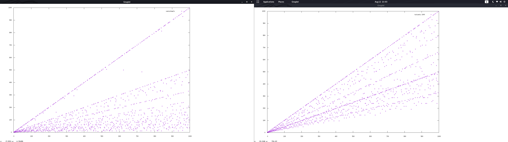

# Nos-Santos-Izquierdo Field


The image shows the expansion of the sum of factors in semiprimes.

# PRIME PERIOD GRIMOIRE VOL. 2

This grimoire is a draft under continuous development. 

It explains how the Nos-Santos-Izquierdo Field (NSIF) works, focusing in the similarities between the RSA problem, factorization, and the calculation decimal expansions.

RSA is used to verify if a number is a valid divisor of the period in the decimal expansion.

The NSIF method is an efficient way to calculate the N decimal expansion, for semiprimes.

The NSIF method allows calculating the sum of factors in a efficient way, without knowing the prime factors, when the product of primes are in the field.

The NSIF method can improves factorization methods for the majority of small numbers and a significant percentage of large numbers. When the period expansion is near n^2

The NSIF method proofs factorization and decrypt a message with RSA are diferent problems, depending N is more fast factorize or decrypt a message.

The code of Nos-Santos-Izquierdo Field has been written in the Haskell programming language.


## Grimoire basic spells

These spells are from famous math researchers, including Fermat. Euler. Carmichael.

- The RSA problem 

  - Encrypt
  
    m = powMod m e n = mc

  - Decrypt

    mc = powMod
  
- Other known formulas

  p^2 mod 6 = 1

  N^2 = x6+1 * y6+1

  Totient = N - (sum factors) - 1

  totient mod carmichael = 0

  period T = powMod 10 T N = 1

  carmichael(n) mod T(n) = 0
  
  totient(n) mod T(n) = 0
  
  x^2 - y^2 mod N = 0


# Spells logics

Any number can be represented by 

N = time * period + (sum factors N) - 1

Nos semiprimes are the product of primes which follow the following formulas:

Deduction of a perfect prime square:

p^2 * p^2 = n^2

Deduction for different factors:

p^2 * q^2 = n^2

Then 

p^2 * q^2 = n^2 and p^2 mod 6 = 1

Then 

t = times of decimal expansion length

( (sqrt x6+1)* (sqrt y6+1) ) - ((sqrt 6x+1) + (sqrt y6+1)) +1 = t * T -> RSA Solution

p^2 - p mod T = 0

Then in squares or numbers with square proportion

N^2+N^2 - N^2  mod T = 0

or 

n^2 - x mod T = 0 

Sum Factors q p = (mod N T) * t + 1


# Conjure spells

````

-- COMPUTE CARMICHAEL DERIVATION
-- The first paremeter is n (the semiprime) and the second the Nos-Santos-Izquierdo Field.

nsf n s = (n^(2) - 1) -s


-- EXTRACT PRIVATE KEY WITH EXPONENT AND N IN NSS NUMBERS 

nss_privatekey e n s= modular_inverse e (nsf n s)

-- EXTRACT FACTORS in NSIF numbers

nsf_factorise_ecm n = (sg2-qrest, sg2+qrest) 
	where
	sigma = (n+1)-(totient n)
	sg2 = div sigma 2   
	qrest = integerSquareRoot ((sg2^2)-n)


nsf_factorise n t= (sg2-qrest, sg2+qrest) 
	where
	sigma = ((n+1))-(t)
	sg2 = div sigma 2   
	qrest = integerSquareRoot ((sg2^2)-n)


-- MAP NSIF PRODUCT OF PRIMES

-- N bits mapping

--for strong nss

nsf_map s x r= map fst (filter (\(x,c)-> c==0) $ map (\x-> (x,tryperiod x (nsf x r))) ([2^s..2^s+x]))


-- N bits mapping checking with ECM just products of two primers

nsf_find nbits range to = take to $ filter (\(v,c)-> length c==2) (map (\x-> (x,P.factorise x)) (nsf_map (nbits) range 0))

-- N bits mapping without perfect squares nor prime numbers it is very slow at checking primality, delete for faster mapping, pending change to a faster test 

nsf_map_nsq s x r =  filter (\(d)-> snd (integerSquareRootRem d) /= 0 ) (nsf_map s x r) 


-- CHECK PERIOD LENGTH FOR N Using RSA, encrypt and decrypt to check the field, period is is n^2 - NSIF(e,x)
tryperiod n period = (powMod (powMod (2) 1826379812379156297616109238798712634987623891298419 n) (modular_inverse 1826379812379156297616109238798712634987623891298419 period) n) - (2) 

-- GET DIVISORS WITH ECM METHOD
divs n = read $ concat (tail (splitOn " " (show (divisors n))))::[Integer]

-- GET SUM OF FACTORS WITH ECM

sum_factors n = n + 1 - (totient n) 


-- DECIMAL EXPANSION, THE PERIOD


-- Efficient way to calculate decimal expansion in semiprime numbers

-- With P Q
tpq p q = out
	where
	tp = div_until_mod_1 (p-1) (p-1)
	tq = div_until_mod_1 (q-1) (q-1)
	out = (lcm tp tq)


-- With N and ECM 
tn n = tp
	where
	c = carmichael n
	tp = div_until_mod_1 (c) (c)
	

div_until_mod_1 p last
	| period == 1 = div_until_mod_1 dp dp 
	| mp /= 0 = last
	| otherwise = last
	where
	(dp,mp) = divMod (p) 2
	period = powMod 10 dp (p+1)


-- Decimal expansion in a traditional slow way
period n = (length (takeWhile (/=1) $ map (\x -> powMod 10 x n ) ( tail [0,1..n])) ) +1

-- All numbers which decode msg, decode a number in a different kind of field

alldecnss n = filter (\(c)-> tryperiod n (n^2) == 0 || tryperiod n (n^2 - c-1)==0 || tryperiod n (n^2 + c-1) == 0 ) $ (tail [0,3..n])


alldec2 n = take 1000 $ filter (\(z,y) -> y == 0 ) (map (\x-> (x , tryperiod n ((x^2) + (x*6))) ) (reverse [1..n]))


alldec n = filter (\(z,y) -> y == 0) (map (\x->(x,tryperiod n x)) [1..n])


````


# Casting spells, nsiZ = 0

```
-- We search for NSS numbers among 512 bits and 512 bit + 1000

*Nss> nsf_map_nsq 512 1000 (0)

[13407807929942597099574024998205846127479365820592393377723561443721764030073546976801874298166903427690031858186486050853753882811946569946433649006084097,13407807929942597099574024998205846127479365820592393377723561443721764030073546976801874298166903427690031858186486050853753882811946569946433649006084171,13407807929942597099574024998205846127479365820592393377723561443721764030073546976801874298166903427690031858186486050853753882811946569946433649006084241,13407807929942597099574024998205846127479365820592393377723561443721764030073546976801874298166903427690031858186486050853753882811946569946433649006084381,13407807929942597099574024998205846127479365820592393377723561443721764030073546976801874298166903427690031858186486050853753882811946569946433649006084823]

(1.14 secs, 1,208,564,264 bytes)

-- We search for NSS numbers among 2048 bits and 2048 bit + 1000

*Nss> nsf_map_nsq 2048 1000 (0)

[32317006071311007300714876688669951960444102669715484032130345427524655138867890893197201411522913463688717960921898019494119559150490921095088152386448283120630877367300996091750197750389652106796057638384067568276792218642619756161838094338476170470581645852036305042887575891541065808607552399123930385521914333389668342420684974786564569494856176035326322058077805659331026192708460314150258592864177116725943603718461857357598351152301645904403697613233287231227125684710820209725157101726931323469678542580656697935045997268352998638215525166389437335543602135433229604645318478604952148193555853611059596230657,32317006071311007300714876688669951960444102669715484032130345427524655138867890893197201411522913463688717960921898019494119559150490921095088152386448283120630877367300996091750197750389652106796057638384067568276792218642619756161838094338476170470581645852036305042887575891541065808607552399123930385521914333389668342420684974786564569494856176035326322058077805659331026192708460314150258592864177116725943603718461857357598351152301645904403697613233287231227125684710820209725157101726931323469678542580656697935045997268352998638215525166389437335543602135433229604645318478604952148193555853611059596231637]

(16.11 secs, 8,801,785,040 bytes)

-- We search for NSS numbers among 4096 bits and 4096 bits + 1000

*Nss> nsf_map_nsq 4096 1000 (0)

[1044388881413152506691752710716624382579964249047383780384233483283953907971557456848826811934997558340890106714439262837987573438185793607263236087851365277945956976543709998340361590134383718314428070011855946226376318839397712745672334684344586617496807908705803704071284048740118609114467977783598029006686938976881787785946905630190260940599579453432823469303026696443059025015972399867714215541693835559885291486318237914434496734087811872639496475100189041349008417061675093668333850551032972088269550769983616369411933015213796825837188091833656751221318492846368125550225998300412344784862595674492194617023806505913245610825731835380087608622102834270197698202313169017678006675195485079921636419370285375124784014907159135459982790513399611551794271106831134090584272884279791554849782954323534517065223269061394905987693002122963395687782878948440616007412945674919823050571642377154816321380631045902916136926708342856440730447899971901781465763473223850267253059899795996090799469201774624817718449867455659250178329070473119433165550807568221846571746373296884912819520317457002440926616910874148385078411929804522981857338977648103126085903001302413467189726673216491511131602920781738033436090243804708340403154190337]

(85.54 secs, 29,012,371,256 bytes)

*Ncs> P.factorise 

32317006071311007300714876688669951960444102669715484032130345427524655138867890893197201411522913463688717960921898019494119559150490921095088152386448283120630877367300996091750197750389652106796057638384067568276792218642619756161838094338476170470581645852036305042887575891541065808607552399123930385521914333389668342420684974786564569494856176035326322058077805659331026192708460314150258592864177116725943603718461857357598351152301645904403697613233287231227125684710820209725157101726931323469678542580656697935045997268352998638215525166389437335543602135433229604645318478604952148193555853611059596230657

[(Prime 974849,1),(Prime 319489,1),(Prime 3560841906445833920513,1),(Prime 167988556341760475137,1),(Prime 173462447179147555430258970864309778377421844723664084649347019061363579192879108857591038330408837177983810868451546421940712978306134189864280826014542758708589243873685563973118948869399158545506611147420216132557017260564139394366945793220968665108959685482705388072645828554151936401912464931182546092879815733057795573358504982279280090942872567591518912118622751714319229788100979251036035496917279912663527358783236647193154777091427745377038294584918917590325110939381322486044298573971650711059244462177542540706913047034664643603491382441723306598834177,1)]

(255.44 secs, 139,784,410,360 bytes)

-- The same number with nsif, the result can be used just to decrypt messages

*Ncs> nsf_derivate 

32317006071311007300714876688669951960444102669715484032130345427524655138867890893197201411522913463688717960921898019494119559150490921095088152386448283120630877367300996091750197750389652106796057638384067568276792218642619756161838094338476170470581645852036305042887575891541065808607552399123930385521914333389668342420684974786564569494856176035326322058077805659331026192708460314150258592864177116725943603718461857357598351152301645904403697613233287231227125684710820209725157101726931323469678542580656697935045997268352998638215525166389437335543602135433229604645318478604952148193555853611059596230657 0

1090748135619415929462984244733782862448264161996232692431832786189721331849119295216264234525201987223957291796157025273109870820177184063610979765077554799078906298842192989538609825228048205159696851613591638196771886542609324560121290553901886301017900252535799917200010079600026535836800905297805880952350501630195475653911005312364560014847426035293551245843928918752768696279344088055617515694349945406677825140814900616105920256438504578013326493565836047242407382442812245131517757519164899226365743722432277368075027627883045206501792761700945699168497257879683851737049996900961120515655050115561271491492650348193034720874286677484276236292738360032427424499556087095685492411030037658394224675291348582549900366367751803851134229176222246053732573886716540132974692707656504829835895230804700756996390295202861628346718823341756870822754141487307239815742670278665202751081355616304460399061822178598405881592730671888574460873116555274647938675160051135013661897264411327302320062816660145275652046102386986045231714289442087627263156698025113552165137851053002154671504474163410014316150213265210996604053694215054918380243978889072417106810007251322768037625419046711242041688551816912017849643882145624091467997755147091355675734185974160209629676817478569439949760061986659873247483860151384711838819847971879800570513833402333507393938226111603954541625197001966192109968104317511803763550038288766118922098516653774476136581381014390304112974960063451749349604883803323902228760921708334299259268125946091730955314683277490942533548746506202127475807471500401460617142836800292103577992430755160251238602323394213583632656965253149096861749380516378003216408209038683421011871494287569465422531530642205205073129569493427227739546147105079664787449171649128052801709255949486484379077059258349162391480798326864932932834842515542279589315516655148314298719294501729506842778593480562532831990993194375685370360061430941009295478030667258081258763591442456839836973894497305667881102724598263788364827567908333606246994412638375833514165086405343617672500646480029965500025850930928771266185847367242628983352946677572047221550254440121493035836929609070120160792344392937267112595565218747798821770998461176733098871949180646683406498949765129952093369223845696772038548581120928627968028353467380514509562595576815401056920410765506175547033857152659648078156542286195102879131303719245035363293091973519004299352296982764041402732402399407767552

(0.01 secs, 1,948,808 bytes)


```

The spell show how easy is to solve faster many numbers than the factorization for message decryption.

# Conclusion

For all products of primes who have the same proportion of n - sum factors in n^2 it is significantly easier to calculate a private key to decrypt a message.

When a multiple of carmichael is near n^2 is more easy decrypt than factorize.

The spells proves that find and decrypt with a public key and NSIF is faster than factorizing just one of the numbers, if you just want to decrypt a message you can use the NSIF if the number is "vulnerable", just in 0.01 seconds vs 255 seconds to factorize the number with the parallel ECM method.

Clearly in trillions of cases you can decrypt or solve rsa significantly faster than the current fastest factorization methods like GNFS or ECM when (p * q) are 

## n^2 - NSIF(e,x) mod T = 0

Many keys are vulnerable to find the message deciphered in just one operation, and some operations more to factorize the number if you can factorize the NSIF derivation. 

Just some seconds to get keys of 512, 1024, 2048 and 4096 bits vulnerable to the Nos-Santos-Izquierdo Field

A method exists to calculate that for all numbers directly grouped by this kind of field. You need to factorize after you know the field, the result of the computation of NSS. This means the factorization process is a bit more expensive than decryption process.

A number smaller than Carmichael needed to decrypt can also be calculated, maybe in some cases such number is better for computation because of its size, and when the period is smaller than Carmichael the modular inverse of exponent and Carmichael can be smaller. This means in some cases decryption can be performed faster. 

## T(n) = lcm T1 T2

The RSA algorithm allows us to check divisors of the period. We can know if something is a divisor of the period, the Carmichael number or the Euler Totient. When RSA is used to decrypt messages.

````

tryperiod n period = (powMod (powMod (2) 1826379812379156297616109238798712634987623891298419 n) (modular_inverse 1826379812379156297616109238798712634987623891298419 period) n) - (2) 


````
tryperiod computes the RSA algorithm to encrypt and decrypt a test number.

The maps of the demonstration result in the numbers who have the same period n^2 - NSIF(e,x), which decrypt the message "2". 

This means the same function with the same parameters can decrypt infinitely different public key groups.

## PrivateKey = PublicKeyN^2 - NSIF(PublicKeyE, x)

The exponent changes the field but always contains Totient, Carmichael and period numbers and derivations of them.

This seems obvious, but it is awesome how the decimal expansion of a number is really close to the square, allowing us to group the numbers by fields. Of course you can find new fields each time you increase the numbers, from just a few fields for small numbers, more fields appear as you define larger numbers. But the same field which works with small numbers also works in 256, 512, 1024 and 2048 bit ones. 

The numbers can stay in didferent Period Fields at the same time. Because different numbers have the same decimal expansion and they cross with others in his expansion.


# General Decimal Expansion Longitude Field Conjecture 


All numbers in a field can be decrypted just by one operation knowing the field. Each image represents  the numbers who can by decripted in each field, with the same field you can decrypt all different numbers, the image is in a small scale to understad how it works.

All numbers can be explained as :

## N = t * T + (SUM FACTORS) - 1

Decimal Expansion Longitude = (T) or Period

All numbers can be grouped by his period (T) field . The distance among n^2 and T multiple in any number

## nsif n e x = (powMod (powMod (2) e n) (modular_inverse e n^2-x) n) - (2) == 0

## nsiZ = n^2 - NSIF(n,e,x)

To calculate decimal expansion distances of squares. The nos santos field. The X is the field

*e allways a coprime of period , totient or carmichael. using a big prime number is enougth.


## T(n^2) = lcm T(n) n


##  factors N T 
	
	P = ((N - T) +1 / 2 +1) +  sqrt ( ((N - T) +1 / 2 )^2 - N ) 
	
	Q = ((N - T) +1 / 2 ) -  sqrt ( ((N - T) +1 / 2 )^2 - N )
	
## Period of decimal expansion

	-- With P Q
	tpq p q = out
		where
		tp = div_until_mod_1 (p-1) (p-1)
		tq = div_until_mod_1 (q-1) (q-1)
		out = (lcm tp tq)


	-- With N and ECM 
	tn n = tp
		where
		c = carmichael n
		tp = div_until_mod_1 (c) (c)


	div_until_mod_1 p last
		| period == 1 = div_until_mod_1 dp dp 
		| mp /= 0 = last
		| otherwise = last
		where
		(dp,mp) = divMod (p) 2
		period = powMod 10 dp (p+1)


## The fields are crossing the lines of carmichael expansion (private keys)



## nsZ = n^2 - NSIF(n,e,x)


## Example and proof of a field englobes a group of period , carmichaels or totient (private keys), and same numbers can be found in diferent fields.

Just one operation to decrypt messages, one quadratic more to factorize, one more to calculate the decimal expansion of N, with the same "KEY" for all group.


````

map 1000 numbers from 2^2 to 2^2+1000 who are in the field 5

*Nss> e=nsf_map_nsq 2 1000 (5)

(0.01 secs, 0 bytes)

*Nss> e

[6,10,11,18,21,31,35,42,45,54,66,69,90,101,126,150,154,174,186,246,281,306,315,331,341,366,378,406,430,431,434,451,474,518,522,546,553,570,630,639,682,685,723,770,774,798,819,870,906,978,981]

(0.09 secs, 89,292,144 bytes)

get period from  e mapping

*Nss> map period it

[7,11,2,19,6,15,36,43,46,55,67,22,91,4,127,151,155,175,187,247,28,307,316,110,30,367,379,407,431,215,435,10,475,519,523,547,78,571,631,35,683,686,30,771,775,799,6,871,907,979,108]

(0.07 secs, 51,419,840 bytes)

get carmichael from e mapping

*Nss> map carmichael e

[2,4,10,6,6,30,12,6,12,18,10,22,12,100,6,20,30,28,30,40,280,48,12,330,30,60,18,84,84,430,30,40,78,36,84,12,78,36,12,210,30,136,240,60,42,18,12,28,150,162,108]
(0.01 secs, 328,512 bytes)


get totient from e mapping 

*Nss> map totient e

[2,4,10,6,12,30,24,12,24,18,20,44,24,100,36,40,60,56,60,80,280,96,144,330,300,120,108,168,168,430,180,400,156,216,168,144,468,144,144,420,300,544,480,240,252,216,432,224,300,324,648]


````

As you can see diferrent private keys can be solved from all collection of field 5


## Proof of more multiples of x can be found than multiples of factors from 0 to N, using NSIF fields.

````

-- function to try all fields until N, tunned with 2*3 because all carmichael numbers can be divided by 6 , by this way we get more numbers who decrypt with + 1
is to reduce number of loops , because we are just interested in multiples of 6

-- improbes rsa method for decryption.


alldec2 n = take 1000 $ filter (\(z,y) -> y == 0 ) (map (\x-> (x , tryperiod n ((x^2) + (x*6))) ) (reverse [1..n]))


*Nss> alldec2 1189

[(1184,0),(1170,0),(1155,0),(1134,0),(1130,0),(1120,0),(1114,0),(1100,0),(1094,0),(1092,0),(1090,0),(1074,0),(1072,0),(1068,0),(1064,0),(1054,0),(1050,0),(1044,0),(1030,0),(1020,0),(1016,0),(1010,0),(1009,0),(995,0),(994,0),(983,0),(980,0),(974,0),(960,0),(946,0),(940,0),(925,0),(924,0),(917,0),(910,0),(904,0),(900,0),(890,0),(889,0),(884,0),(882,0),(855,0),(854,0),(844,0),(840,0),(834,0),(820,0),(819,0),(812,0),(806,0),(784,0),(780,0),(778,0),(770,0),(764,0),(760,0),(750,0),(734,0),(724,0),(722,0),(714,0),(700,0),(694,0),(686,0),(680,0),(672,0),(666,0),(663,0),(644,0),(642,0),(640,0),(630,0),(629,0),(624,0),(623,0),(610,0),(582,0),(574,0),(570,0),(560,0),(559,0),(554,0),(540,0),(539,0),(525,0),(522,0),(504,0),(490,0),(484,0),(470,0),(462,0),(448,0),(444,0),(442,0),(441,0),(440,0),(434,0),(429,0),(420,0),(414,0),(400,0),(399,0),(392,0),(390,0),(386,0),(380,0),(372,0),(366,0),(364,0),(360,0),(350,0),(344,0),(336,0),(330,0),(322,0),(319,0),(316,0),(310,0),(294,0),(288,0),(284,0),(280,0),(274,0),(267,0),(260,0),(243,0),(240,0),(234,0),(225,0),(224,0),(210,0),(204,0),(190,0),(176,0),(155,0),(154,0),(140,0),(134,0),(124,0),(120,0),(119,0),(114,0),(90,0),(84,0),(70,0),(64,0),(60,0),(57,0),(50,0),(49,0),(44,0),(42,0),(36,0),(34,0),(28,0),(15,0),(14,0)]

*Nss> length it


157


*Nss> P.factorise 1189


[(Prime 29,1),(Prime 41,1)]

*Nss> 41+29

70

````

This demostrates how de multiples of divisors of carmichael can decrypt message "2" in 157 from 0 to 1189, and how just 70 multiples of 29 and 41 are to be found from 0 to 1189

In probability terms allways is more probable find a number who decrypts than a factor of N if the longitudes of the periods of decimal expansion of the semiprime are small.

This probability changes when the prime factors have a long or large period.

Increase the probability of succes for x value when makes the product * 6

This means the probability to decrypt is linked to the period longitude behavior not to factors factorization.

The probability to decrypt rsa are de multiples of carmichael divisors when is applied as a Nos-Santos-Izquierdo Field


## Proof more numbers from 0 to N who decrypts a message than factorize a number

Calculate numbers who decrypts a message from 0 to N


````

*Nss> length $ alldec2 427

94

*Nss> length $ alldec2 203

30

*Nss> length $ alldec2 323

78

*Nss> length $ alldec2 377

58

*Nss> length $ alldec2 2049

409


````

As wikipedia say .... Rivest, Shamir, and Adleman noted[2] that Miller has shown that – assuming the truth of the Extended Riemann Hypothesis – finding d from n and e is as hard as factoring n into p and q (up to a polynomial time difference).However, Rivest, Shamir, and Adleman noted, in section IX/D of their paper, that they had not found a proof that inverting RSA is equally as hard as factoring. ... 


Calculate numbers from 0 to N , who have common factors p or q, (P + Q)

*Libs.Events> rsigma 377

42

*Libs.Events> rsigma 427

68

*Libs.Events> rsigma 1189

70

*Libs.Events> rsigma 1121

78

*Libs.Events> rsigma 767

72

*Libs.Events> rsigma 323

36

*Libs.Events> rsigma 2049

686

When the primes are weak (with small period) you have a lot more probabilities than in factorization to decrypt the message.

Seems clear in some cases you have mor multiples who gcd n multiple = factor is more probable, and others is more probable decrypt befor find a multiple with common factor from 0 to N. 


*Libs.Events> rsigma 2049

686


This is a contradiction , assume than Rivest, Shamir, and Adleman demostration is true. Because decrypt and factorize are linked to different things, the first to the length of decimal expansion period , the second to the value of factors of N.

PROBABILITIES TO DECRYPT > PROBABILITIES TO FACTORIZE

Like more semiprimes are composed by by weak primes in period terms, than strong periods, we can deduce more semiprimes going to have  more probabilities to be decrypted than to be factorized.

In the nss.hs you can review and test with the library.

# Field bruteforce

We get the first 100 numbers of 512 bits and try fields until 1000 for each number

````

map (\x-> field_crack x 0) [2^512..2^512+100]

[(0,0),(13407807929942597099574024998205846127479365820592393377723561443721764030073546976801874298166903427690031858186486050853753882811946569946433649006084097,0),
(13407807929942597099574024998205846127479365820592393377723561443721764030073546976801874298166903427690031858186486050853753882811946569946433649006084098,34),(0,0),
(0,0),(0,0),(0,0),(0,0),(0,0),(0,0),(0,0),
(13407807929942597099574024998205846127479365820592393377723561443721764030073546976801874298166903427690031858186486050853753882811946569946433649006084107,543),
(0,0),(0,0),(0,0),(0,0),(0,0),(0,0),(0,0),(0,0),(0,0),(0,0),(0,0),(0,0),(0,0),(0,0),(0,0),(0,0),(0,0),(0,0),(0,0),(0,0),(0,0),(0,0),(0,0),(0,0),(0,0),(0,0),(0,0),
(0,0),(0,0),(0,0),(0,0),(0,0),(0,0),(0,0),(0,0),(0,0),(0,0),(0,0),(0,0),(0,0),(0,0),(0,0),(0,0),(0,0),(0,0),(0,0),(0,0),(0,0),(0,0),(0,0),(0,0),(0,0),(0,0),(0,0),
(0,0),(0,0),(0,0),(0,0),(0,0),(0,0),(0,0),(0,0),(0,0),
(13407807929942597099574024998205846127479365820592393377723561443721764030073546976801874298166903427690031858186486050853753882811946569946433649006084171,0),(0,0),
(0,0),(0,0),(0,0),(0,0),(0,0),(0,0),(0,0),(0,0),(0,0),(0,0),(0,0),(0,0),(0,0),(0,0),(0,0),(0,0),(0,0),(0,0),(0,0),(0,0),(0,0),(0,0),(0,0),(0,0)]


````

Trying to factorize with ECM the no prime numbers 

````


P.factorise 

13407807929942597099574024998205846127479365820592393377723561443721764030073546976801874298166903427690031858186486050853753882811946569946433649006084098

[(Prime 2,1),(Prime 3,1),(Prime 43,1),(Prime 1753,1),(Prime 3191707,1),(Prime 10435643,1),(Prime 1795918038741070627,1),(Prime 44523886942460772001,1) ....

No more factors after some minutes.


````

We can see how big numbers who we can't factorize we can decrypt because his period expansion cross near N^2. In 100 numbers of 512 bits 2 % have the period expansion near n^2, and just checking 1000 numbers around n^2 in the bruteforce.

We are working in a GPU CUDA bruteforce algorithm, cooming soon published, with that around 2000 * 1000000 of numbers can be checked by each Geoforce GT 1060 doing fast. Will be enougth ? We don't beilive but we going to try. For sure the percentage going to increase.


# Frequency of small field

test with 22 bits

````

*Nsif> map ( \x-> field_crack x 0) [2^22..2^22+100]

[(0,0),(4194305,5),(4194306,10),(4194307,1379),(0,0),(4194309,21),(4194310,23124),(4194311,11),(0,0),(4194313,181),(4194314,14944),(4194315,135),(0,0),(4194317,1721),
(4194318,6),(4194319,0),(0,0),(4194321,3),(4194322,22),(4194323,2597),(0,0),(4194325,45),(4194326,5672),(4194327,45),(0,0),(4194329,0),(4194330,210),(4194331,31),
(0,0),(4194333,123),(4194334,298),(4194335,35),(0,0),(4194337,7),(4194338,2),(4194339,3),(0,0),(4194341,41),(4194342,1812),(4194343,439),(0,0),(4194345,285),
(4194346,134),(4194347,79),(0,0),(4194349,247),(4194350,3374),(4194351,441),(0,0),(4194353,0),(4194354,6),(4194355,55),(0,0),(4194357,57),(4194358,818),(4194359,221),
(0,0),(4194361,35),(4194362,62),(4194363,3),(0,0),(4194365,35),(4194366,330),(4194367,79191),(0,0),(4194369,3671),(4194370,918),(4194371,0),(0,0),(4194373,275),
(4194374,94),(4194375,275),(0,0),(4194377,543),(4194378,18),(4194379,109),(0,0),(4194381,3),(4194382,82),(4194383,24482),(0,0),(4194385,661),(4194386,406),(4194387,9),
(0,0),(4194389,0),(4194390,30),(
,3285),(0,0),(4194393,63),(4194394,74),(4194395,4965),(0,0),(4194397,0),(4194398,26),(4194399,2093),(0,0),(4194401,34908),
(4194402,114),(4194403,0),(0,0)]

````

Works in a sequence , each 3 numbers with small field in a square 1 number don't have this property.


````

*Nsif> filter (>0) it

[4194305,4194306,4194307,4194309,4194310,4194311,4194313,4194314,4194315,4194317,4194318,4194319,4194321,4194322,4194323,4194325,4194326,4194327,4194329,4194330,419433
1,4194333,4194334,4194335,4194337,4194338,4194339,4194341,4194342,4194343,4194345,4194346,4194347,4194349,4194350,4194351,4194353,4194354,4194355,4194357,4194358,41943
59,4194361,4194362,4194363,4194365,4194366,4194367,4194369,4194370,4194371,4194373,4194374,4194375,4194377,4194378,4194379,4194381,4194382,4194383,4194385,4194386,4194
387,4194389,4194390,4194391,4194393,4194394,4194395,4194397,4194398,4194399,4194401,4194402,4194403]


````

All kind of numbers inside the test mapping, include semiprimes

````

*Nsif> map P.factorise it

[[(Prime 5,1),(Prime 397,1),(Prime 2113,1)],[(Prime 2,1),(Prime 3,2),(Prime 43,1),(Prime 5419,1)],[(Prime 13,1),(Prime 19,1),(Prime 16981,1)],[(Prime 3,1),(Prime 
7,1),(Prime 199729,1)],[(Prime 2,1),(Prime 5,1),(Prime 59,1),(Prime 7109,1)],[(Prime 11,1),(Prime 381301,1)],[(Prime 181,1),(Prime 23173,1)],[(Prime 2,1),(Prime 53,1),
(Prime 39569,1)],[(Prime 3,3),(Prime 5,1),(Prime 31069,1)],[(Prime 463,1),(Prime 9059,1)],[(Prime 2,1),(Prime 3,1),(Prime 699053,1)],[(Prime 4194319,1)],[(Prime 
3,1),(Prime 1398107,1)],[(Prime 2,1),(Prime 11,1),(Prime 83,1),(Prime 2297,1)],[(Prime 7,1),(Prime 199,1),(Prime 3011,1)],[(Prime 5,2),(Prime 17,1),(Prime 71,1),(Prime 
139,1)],[(Prime 2,1),(Prime 19,1),(Prime 23,1),(Prime 4799,1)],[(Prime 3,1),(Prime 47,1),(Prime 151,1),(Prime 197,1)],[(Prime 4194329,1)],[(Prime 2,1),(Prime 
3,1),(Prime 5,1),(Prime 7,1),(Prime 19973,1)],[(Prime 31,1),(Prime 135301,1)],[(Prime 3,2),(Prime 11,1),(Prime 13,1),(Prime 3259,1)],[(Prime 2,1),(Prime 67,1),(Prime 
113,1),(Prime 277,1)],[(Prime 5,1),(Prime 751,1),(Prime 1117,1)],[(Prime 7,1),(Prime 599191,1)],[(Prime 2,1),(Prime 2097169,1)],[(Prime 3,1),(Prime 1398113,1)],[(Prime 
41,1),(Prime 102301,1)],[(Prime 2,1),(Prime 3,4),(Prime 17,1),(Prime 1523,1)],[(Prime 283,1),(Prime 14821,1)],[(Prime 3,1),(Prime 5,1),(Prime 19,1),(Prime 14717,1)],
[(Prime 2,1),(Prime 13,1),(Prime 353,1),(Prime 457,1)],[(Prime 79,1),(Prime 53093,1)],[(Prime 23,1),(Prime 43,1),(Prime 4241,1)],[(Prime 2,1),(Prime 5,2),(Prime 
149,1),(Prime 563,1)],[(Prime 3,2),(Prime 7,2),(Prime 9511,1)],[(Prime 4194353,1)],[(Prime 2,1),(Prime 3,1),(Prime 699059,1)],[(Prime 5,1),(Prime 11,1),(Prime 
76261,1)],[(Prime 3,1),(Prime 29,1),(Prime 37,1),(Prime 1303,1)],[(Prime 2,1),(Prime 7,1),(Prime 131,1),(Prime 2287,1)],[(Prime 13,1),(Prime 17,1),(Prime 18979,1)],
[(Prime 73,1),(Prime 57457,1)],[(Prime 2,1),(Prime 31,1),(Prime 67651,1)],[(Prime 3,1),(Prime 1398121,1)],[(Prime 5,1),(Prime 7,1),(Prime 119839,1)],[(Prime 
2,1),(Prime 3,1),(Prime 11,1),(Prime 103,1),(Prime 617,1)],[(Prime 53,1),(Prime 79139,1)],[(Prime 3,3),(Prime 59,1),(Prime 2633,1)],[(Prime 2,1),(Prime 5,1),(Prime 
607,1),(Prime 691,1)],[(Prime 4194371,1)],[(Prime 541,1),(Prime 7753,1)],[(Prime 2,1),(Prime 47,1),(Prime 44621,1)],[(Prime 3,1),(Prime 5,4),(Prime 2237,1)],[(Prime 
11,1),(Prime 97,1),(Prime 3931,1)],[(Prime 2,1),(Prime 3,2),(Prime 233021,1)],[(Prime 7,1),(Prime 601,1),(Prime 997,1)],[(Prime 3,1),(Prime 1398127,1)],[(Prime 
2,1),(Prime 41,1),(Prime 51151,1)],[(Prime 19,1),(Prime 220757,1)],[(Prime 5,1),(Prime 13,1),(Prime 173,1),(Prime 373,1)],[(Prime 2,1),(Prime 7,1),(Prime 29,1),(Prime 
10331,1)],[(Prime 3,2),(Prime 466043,1)],[(Prime 4194389,1)],[(Prime 2,1),(Prime 3,1),(Prime 5,1),(Prime 139813,1)],

[(Prime 1433,1),(Prime 2927,1)] <-- full reptend semi prime with long period, with aprox similar bits

[(Prime 3,1),(Prime 7,1),(Prime 17,1),(Prime 31,1),(Prime 379,1)],[(Prime 2,1),(Prime 37,1),(Prime 56681,1)],[(Prime 5,1),(Prime 23,1),(Prime 36473,1)],[(Prime 
4194397,1)],[(Prime 2,1),(Prime 13,1),(Prime 161323,1)],[(Prime 3,1),(Prime 11,1),(Prime 127103,1)],[(Prime 67,1),(Prime 62603,1)],[(Prime 2,1),(Prime 3,1),(Prime 
19,1),(Prime 36793,1)],[(Prime 4194403,1)]]


````

# testing with other message than "2"

````


-- CHECK PERIOD LENGTH FOR N Using RSA

tryperiod n period = (powMod (powMod (666) 1826379812379156297616109238798712634987623891298419 n) (modular_inverse 
1826379812379156297616109238798712634987623891298419 period) n) - (666) 


*Nsif> map ( \x-> field_crack x 0) [2^22..2^22+100]

[(0,0),(4194305,17),(4194306,27),(4194307,206),(0,0),(4194309,21),(0,0),(4194311,11),(0,0),(4194313,181),(4194314,106),(0,0),(0,0),(0,0),(4194318,6),(4194319,0),(0,0),
(4194321,3),(4194322,22),(0,0),(0,0),(4194325,45),(4194326,874),(0,0),(0,0),(4194329,0),(4194330,210),(4194331,31),(0,0),(4194333,123),(4194334,298),(4194335,35),
(0,0),(4194337,7),(4194338,2),(4194339,3),(0,0),(4194341,41),(0,0),(4194343,439),(0,0),(4194345,285),(4194346,134),(4194347,79),(0,0),(4194349,177),(0,0),
(4194351,441),(0,0),(4194353,0),(4194354,6),(4194355,55),(0,0),(4194357,57),(4194358,818),(4194359,221),(0,0),(4194361,73),(4194362,62),(4194363,3),(0,0),(4194365,35),
(4194366,330),(4194367,53),(0,0),(0,0),(4194370,918),(4194371,0),(0,0),(4194373,275),(4194374,94),(4194375,275),(0,0),(4194377,543),(4194378,18),(4194379,109),(0,0),
(4194381,3),(4194382,82),(4194383,19),(0,0),(4194385,661),(4194386,246),(4194387,9),(0,0),(4194389,0),(4194390,30),(0,0),(0,0),(4194393,63),(4194394,74),(4194395,115),
(0,0),(4194397,0),(4194398,26),(0,0),(0,0),(0,0),(4194402,114),(4194403,0),(0,0)]


````

Similar results with encrypt 666 and decrypt 666. More results 0 because in more cases 666 can't be encrypted and decrypted at 22 bits.


# License

Free usage on Apache License 2.0 for non commercial uses, you can't win money with this paper or derivates. Just redistribute derivates for free.

If some formula dosen't exists  you need to use a mention of the authors
To discuss with the team for commercial porpouses, you can send email to pedro@blackhole.consulting . 

More information about our services in https://blackhole.consulting

# Contributions and collaborations

All contributions are welcome and collaborations are welcome. 

If you want to collaborate as a coder in the project to develop libraies and research experiments you are invited. please contact in pedro@blackhole.consulting

Donations of hardware to build a super computer are welcome, we need graphic cards, micro processors , ram and all kind of computer components to build a cluster for make more fast the investigation. Old gpu rig miners are welcome.

If you have a place with some KW of energy we are glad to build the computer in your place.

If you have a super computer we are glad to do experiemnts toguether.

We are a small group of geeks without resources

Serious paper will be realease soon

# Authors

Main idea, investigation and dirty haskell functions.

Author - Vicent Nos Ripolles, Consultant, Dev, Cybersecurity Auditor, Bussinesman, Hacker (srdelabismo) Spain

Author - Pedro el Banquero - Banker SysAdmin - Panamá

Functions and Performance Haskell and Maths

Co-Author - My master, Enrique S., Physhicist, Maths, Computer Science (MathMax) Spain

Enrique help me to develop all functions and explain me how rsa works and all that i know about maths and cryptografy. 

Co-Author - Francisco Blas Izquierdo, Hacker, Ph.D. student, Chalmers University of Technology" (KLONDIKE) Sweeden

Francisco, checking carmichael divisors using RSA, is his most relevant contribution to this paper.


updated doc in https://github.com/pedroelbanquero/nos-carmichael-spell/blob/master/README.md


